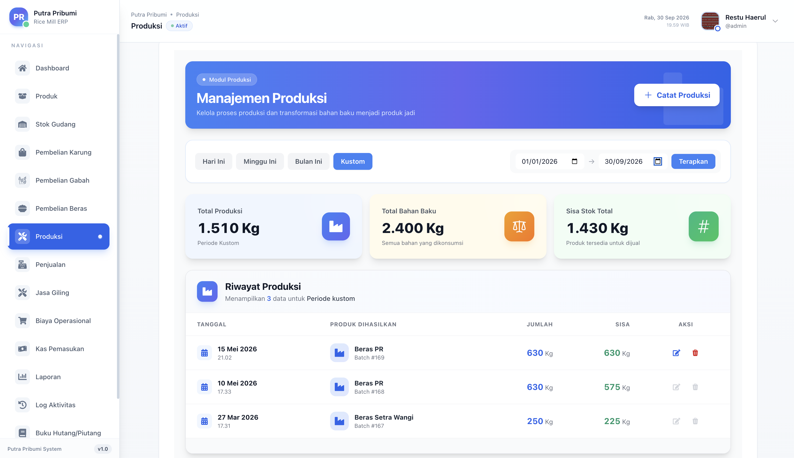

# 🌾 ERP PD Putra Pribumi

**Sistem ERP (Enterprise Resource Planning) lengkap untuk manajemen operasional penggilingan padi.**  
Dibangun dengan Go (Gin) di sisi backend dan React + TypeScript di sisi frontend.

[Dokumentasi API](#api-endpoints) · [Panduan Instalasi](#-instalasi)

 

*(Tampilan UI Aplikasi - Dashboard)*

---

## 📌 Tentang Proyek

**ERP PD Putra Pribumi** adalah sistem manajemen operasional terintegrasi yang dirancang khusus untuk industri penggilingan padi. Sistem ini mencakup seluruh alur bisnis dari pembelian gabah, proses produksi, penjualan hasil giling, manajemen jasa giling, hingga pelaporan keuangan.

Proyek ini dibangun sebagai solusi nyata untuk menggantikan pencatatan manual yang rentan terhadap kesalahan, dan memberikan visibilitas penuh terhadap operasional bisnis secara real-time.

---

## 🔑 Demo & Hak Akses
Jika sistem ini sudah di-deploy secara publik, Anda dapat menguji fitur aplikasi (dengan hak akses terbatas/penuh) menggunakan kredensial berikut:

- **Username:** `admin`
- **Password:** `admin123`
- **Role:** OWNER (Full Access)

---

## ✨ Fitur Utama

### 📦 Manajemen Pembelian
- Pencatatan pembelian gabah dari pemasok dengan tracking batch
- Pembelian beras langsung (trading) dengan sistem FIFO otomatis
- Status pembayaran: Lunas, DP (Sebagian), Hutang
- Riwayat penggunaan stok per batch pembelian

### ⚙️ Produksi & Penggilingan
- Manajemen batch produksi dengan tracking bahan baku multi-sumber
- Kalkulasi HPP (Harga Pokok Produksi) otomatis per batch
- Sistem alokasi bahan baku fleksibel (dari pembelian gabah, stok produk sampingan, atau karung)
- Log produksi lengkap dengan audit trail

### 🛒 Penjualan
- Pencatatan penjualan produk jadi (beras, menir, dedak, dll)
- Penjualan dari stok batch produksi menggunakan algoritma FIFO
- Tracking piutang pelanggan secara otomatis
- Manajemen status pembayaran dan pelunasan

### 🌀 Jasa Giling
- Pencatatan jasa giling untuk pelanggan eksternal
- Kalkulasi biaya jasa berdasarkan berat gabah dan jenis layanan
- Tracking pembayaran jasa giling

### 🏦 Keuangan
- **Kas & Akun Kas**: Manajemen multi-akun kas dengan riwayat transaksi
- **Hutang & Piutang**: Tracking hutang ke pemasok dan piutang dari pelanggan
- **Biaya Operasional**: Pencatatan pengeluaran operasional harian
- **Laporan Keuangan**: Ringkasan pendapatan, HPP, dan laba kotor

### 📦 Inventaris
- Manajemen stok produk (Gabah, Beras, Menir, Dedak, Karung)
- Riwayat aktivitas stok (masuk/keluar) per produk
- Manajemen stok karung dengan tracking penggunaan per batch produksi

### 🔐 Autentikasi & Otorisasi
- JWT-based authentication
- Role-Based Access Control (RBAC) dengan 5 level akses:
  | Role | Akses |
  |------|-------|
  | **OWNER** | Full access ke semua fitur |
  | **ADMIN** | Pembelian, Penjualan, Jasa Giling, Laporan |
  | **KASIR** | Penjualan, Jasa Giling, Stok (read-only) |
  | **GUDANG** | Pembelian, Produksi, Stok, Karung |
  | **VIEWER** | Read-only semua modul |

### 📋 Activity Log
- Pencatatan semua aktivitas user secara otomatis
- Filter berdasarkan user, modul, dan rentang tanggal

---

## 🛠️ Tech Stack

### Backend
| Teknologi | Versi | Kegunaan |
|-----------|-------|---------|
| **Go** | 1.24 | Bahasa pemrograman utama |
| **Gin** | v1.10 | HTTP web framework |
| **GORM** | v1.30 | ORM untuk database MySQL |
| **MySQL** | 8.0 | Database relasional |
| **JWT (golang-jwt)** | v5 | Autentikasi token |
| **godotenv** | v1.5 | Manajemen environment variables |

### Frontend
| Teknologi | Versi | Kegunaan |
|-----------|-------|---------|
| **React** | 19 | UI library |
| **TypeScript** | 4.9 | Type-safe JavaScript |
| **Tailwind CSS** | 3.3 | Utility-first CSS framework |
| **React Router** | v7 | Client-side routing |
| **Recharts** | v3 | Visualisasi grafik dan chart |
| **Headless UI** | v2 | Komponen UI accessible |
| **Heroicons** | v2 | Icon library |
| **React Icons** | v4 | Extended icon library |

---

## 🏗️ Arsitektur Sistem
